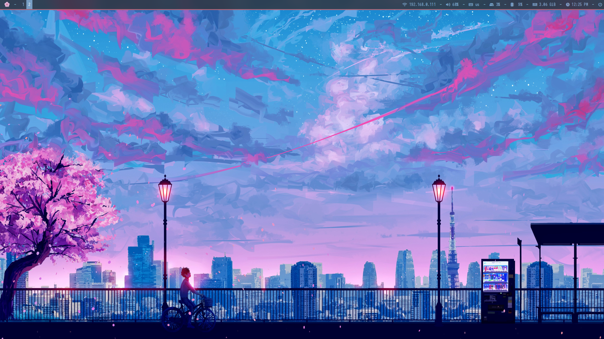
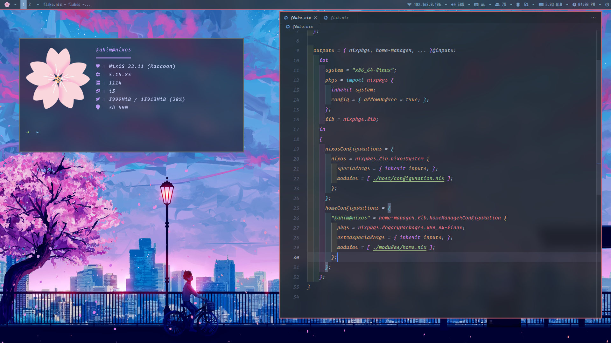

# 🌸 dotfiles-nixos

[My others config file repo](https://github.com/samiulbasirfahim/dotfiles)

Desktop

Terminal + vscode



## File structure 🚧
```
├── flake.lock
├── flake.nix
├── host
│   ├── configuration.nix
│   └── hardware-configuration.nix
├── modules
│   ├── config.nix
│   ├── home.nix
│   ├── hyprland
│   │   ├── default.nix
│   │   └── hyprland.conf
│   ├── neofetch
│   │   ├── config.nix
│   │   ├── default.nix
│   │   └── sakurafetch.png
│   ├── packages
│   │   ├── default.nix
│   │   └── packages.nix
│   ├── shell
│   │   ├── default.nix
│   │   └── fish.nix
│   ├── variables.nix
│   └── window-manager
│       ├── default.nix
│       └── i3.nix
├── pictures
│   ├── screenshot_1673331928.png
│   ├── screenshot_1673344815.png
│   └── wallpaper.jpg
└── readme.md
```